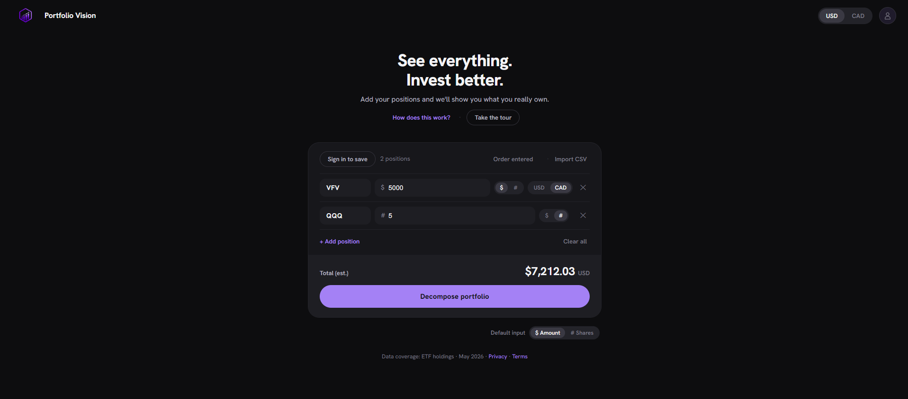
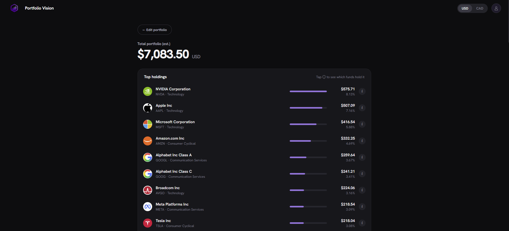

<div align="center">

# Portfolio Vision

**See everything. Invest better.**

Your ETFs, broken down into the companies you actually own.

[**portfoliovision.online**](https://portfoliovision.online)


</div>

---

## The problem

You own VFV, XEQT, and some AAPL. Your brokerage shows you three rows. But VFV holds 500 companies, XEQT holds four other ETFs which together hold thousands, and AAPL is already sitting inside both of them. So how much Apple do you actually own? What percent of your money is in tech? How much is outside North America?

Nobody tells you. Portfolio Vision does.

---

## Screenshots

### Build your portfolio

Enter positions by dollar amount or share count, mix USD and CAD per row, or import a broker CSV. Live prices are fetched on decompose.



### See what you really own

Every ETF is recursively unwrapped into its underlying companies, duplicate positions are merged, and everything is re-weighted against your total.



---

## Features

**Decomposition**
- Recursive ETF unwrapping, so ETFs holding ETFs are resolved automatically (up to 5 levels deep)
- Overlapping positions merged, so `AAPL` held directly and via three funds becomes one correctly-weighted row
- "Which funds hold this?" breakdown on every holding
- Holdings filtered to ≥ 0.25% weight, with the remainder collapsed into a summary row
- Untracked weight surfaced explicitly rather than silently rounded away

**Input**
- Enter positions by dollar amount **or** share count
- Per-row USD/CAD currency toggle, plus a global display-currency toggle
- Wealthsimple CSV import: auto-populates rows as shares, imports CAD-hedged CDRs at their CAD value, skips options
- Rows that can't be priced fall back to dollar entry instead of blocking the whole decomposition

**Analysis**
- Sector and geographic breakdowns with animated bar charts
- Sort holdings by value, ticker, or entry order
- JSON export of decomposed portfolio data

**Platform**
- Live prices via a Yahoo Finance proxy: TSX, TSX-V, Cboe Canada (NEO), CSE, US exchanges, FX and crypto
- Price cache persisted to `localStorage`
- Save and load named portfolios (account required)
- Google OAuth and email/password auth with OTP verification
- Full mobile layout

---

## How decomposition works

```
User input (ticker + amount, or ticker + shares)
        │
        ▼
  PortfolioPanel.runDecompose()
  validate rows → fetch live prices for # rows → shares × priceCAD → dollar amount
        │
        ▼
  App.jsx  ·  committedRows → useMemo
  build { TICKER: dollarAmountInDisplayCurrency }
        │
        ▼
  decompose.js  ·  decompose(portfolio)
  for each ticker:
      ETF   → getHoldings() → recurse (depth ≤ 5)
      stock → accumulate dollars
  returns { result: { ticker → amount }, unknown: [] }
        │
        ▼
  ResultsPanel + ChartSection
```

Two things make this non-trivial in practice:

**Ticker identity is ambiguous.** `XEQT` is the ticker you type, `VEQT.TO` is the key its holdings live under, and `XEQT.TO` is the symbol Yahoo Finance will price. The app keeps two independent alias maps, one for holdings resolution and one for pricing, because collapsing them into one breaks a different set of tickers each way.

**Weights don't sum to 100.** ETF holdings data is truncated and drifts with the market, so leftover weight is tracked and reported as "Untracked" rather than being normalized away and quietly misrepresenting the portfolio.

---

## Architecture

```
┌─────────────┐        ┌──────────────────┐        ┌──────────────┐
│   FRONTEND  │──────▶ │      BACKEND     │──────▶ │   DATABASE   │
│   (React)   │        │ (Vercel API fns) │        │  (Supabase)  │
└─────────────┘        └──────────────────┘        └──────────────┘
        │                       │                          │
        │                       ├─▶ Yahoo Finance proxy    │
        │                       └─▶ Frankfurter FX proxy   │
        │                                                  │
        └─────────────────── auth (OAuth / OTP) ───────────┘
```

1. User interacts with the React frontend
2. Frontend sends price/FX requests to Vercel serverless functions
3. Backend proxies to Yahoo Finance / Frankfurter and shapes the response
4. Supabase stores users, saved portfolios, and an admin mirror of the ETF holdings data
5. Response is returned to the frontend

Decomposition itself runs entirely client-side against a bundled dataset: no round-trip, no rate limit, instant results.

---

## Tech Stack

| Layer | Stack |
|---|---|
| **Frontend** | React 19, Vite 8, React Router 7 |
| **Styling** | Hand-rolled CSS design system (CSS custom properties + inline styles), Tailwind v4 `@theme` tokens |
| **Backend** | Vercel serverless functions (Node) |
| **Database / Auth** | Supabase (Postgres + Auth, RLS-protected) |
| **Data sources** | Yahoo Finance (proxied), Frankfurter API (FX), Logo.dev (company logos) |
| **Hosting** | Vercel, auto-deploy from `main` |
| **Analytics** | Vercel Analytics |

---

## Project Structure

```
portfolio-vision-web/
│
├── frontend/                     # FRONTEND (React + Vite)
│   ├── public/                   # Static files served as-is
│   ├── src/
│   │   ├── assets/               # Static images
│   │   ├── components/           # Reusable UI components
│   │   │   ├── AuthModal.jsx
│   │   │   ├── ChartSection.jsx
│   │   │   ├── CompanyLogo.jsx
│   │   │   ├── HoldingRow.jsx
│   │   │   ├── HorizBar.jsx
│   │   │   ├── ImportCsvModal.jsx
│   │   │   ├── InfoModal.jsx
│   │   │   ├── PortfolioPanel.jsx
│   │   │   └── ResultsPanel.jsx
│   │   ├── layout/               # App shell / global chrome (Header, etc.)
│   │   ├── pages/                # Route-level views (Settings, Privacy, Terms)
│   │   ├── hooks/                # Custom React hooks (reserved)
│   │   ├── context/              # React context providers (reserved)
│   │   ├── services/             # API clients (fetchPrices.js)
│   │   ├── lib/                  # SDK clients (supabase.js)
│   │   ├── utils/                # Pure helpers (decompose, parseHoldingsCsv, colors, format)
│   │   ├── data/                 # Reference data (etf_data.json, source of truth)
│   │   ├── App.jsx
│   │   ├── main.jsx
│   │   ├── App.css
│   │   └── index.css             # Full design system: tokens, utilities, mobile overrides
│   ├── index.html
│   ├── vite.config.js
│   └── eslint.config.js
│
├── api/                          # Vercel serverless functions (MUST live at repo root)
│   ├── price.js                  # Yahoo Finance price proxy
│   └── fxrate.js                 # USD/CAD FX proxy
│
├── backend/                      # BACKEND maintenance / non-runtime scripts
│   └── scripts/
│       └── importEtfData.js      # JSON → Supabase importer
│
├── database/                     # DATABASE (Supabase / Postgres schema)
│   ├── 001_etf_data.sql          # Tables: etf_metadata, etf_holdings, stock_info
│   └── 002_security_fixes.sql    # portfolios RLS + hardened delete_user()
│
├── docs/screenshots/             # README screenshots
├── .env                          # Local env vars (gitignored)
├── package.json                  # One package.json for the whole project
├── vercel.json                   # Routes /api/* and sets build paths
└── README.md
```

The three conceptual layers map to `frontend/` (React app), `api/` + `backend/` (serverless functions + maintenance scripts), and `database/` (Supabase SQL). `api/` lives at the repo root because Vercel requires it there, and it can't be relocated via config. `vercel.json` points the build at `frontend/` and sets the output directory.

---

## Local Development

Price fetching runs through Vercel serverless functions, so use `vercel dev`, **not** `npm run dev`. The plain Vite server doesn't serve `/api/*`, so shares-mode pricing silently fails.

```bash
npm install
npm install -g vercel
vercel dev
```

Other commands:

```bash
npm run build        # production build → frontend/dist/
npm run lint         # eslint over frontend/
npm run preview      # preview the production build
npm run import-etf   # sync etf_data.json → Supabase
```

---

## Environment Variables

`.env` lives at the **repo root**, not inside `frontend/`, because Vite is configured with `envDir: '..'`.

```
VITE_SUPABASE_URL=
VITE_SUPABASE_ANON_KEY=
VITE_LOGO_DEV_KEY=
```

Set the same variables in the Vercel project dashboard under Environment Variables.

---

## Data & Database

[frontend/src/data/etf_data.json](frontend/src/data/etf_data.json) is the single source of truth for all ETF and stock data (~280 KB, bundled with the app). The Supabase tables (`etf_metadata`, `etf_holdings`, `stock_info`) are **admin-only mirrors** and are never queried by the frontend. After editing the JSON:

```bash
npm run import-etf
```

User-saved portfolios live in the `portfolios` table. [database/002_security_fixes.sql](database/002_security_fixes.sql) enables Row-Level Security on it (owner-only access) and hardens the `delete_user()` account-deletion RPC. There's no migration tooling, so run the `.sql` files directly in the Supabase SQL editor, in order.

---

## Deployment

Deployed on Vercel with auto-deploy from the `main` branch.

```bash
git add .
git commit -m "your message"
git push
```

---

## Known Limitations

- ETF holdings data is static and manually maintained in `etf_data.json`. Coverage is as of **May 2026**.
- Yahoo Finance's unofficial API is used for live prices. It isn't a guaranteed service and could change without notice.
- FX conversion for non-USD/CAD currencies treats the raw price as-is and derives the other side via the USD/CAD rate.
- Holdings weights are point-in-time; funds rebalance continuously, so decomposed values are estimates.

---

## About

Built by **Austin Zhai**, second-year Computer Engineering student at UBC. A personal project built to get hands-on experience with full-stack development, API design, and real-world data problems: the kind where the data is messy, the identifiers don't line up, but the result is a potentially significant impact on people investment journey.
